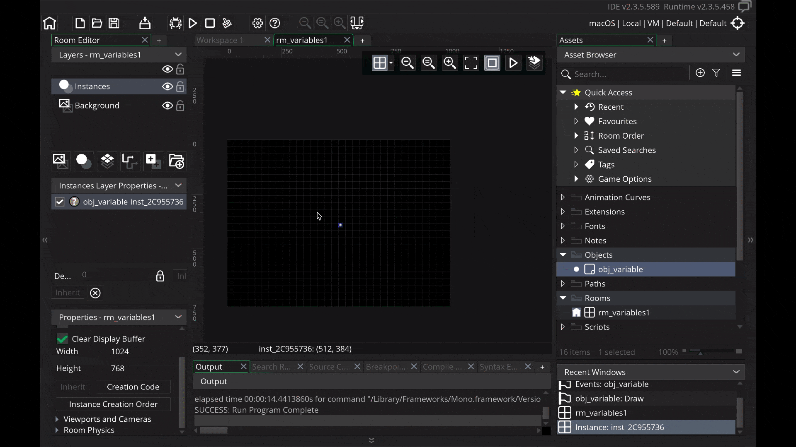

### GMS2 Variables

This tutorial is intended for those wanting an introduction to <i>GameMaker Studio 2</i> using their scrpting language <i>GML</i>. This assumes no prior knowledge of the software or scripting. This walk through looks at [variables](https://manual.yoyogames.com/GameMaker_Language/GML_Overview/Variables_And_Variable_Scope.htm) in GMS2. Variables are used to store information that we can use later on.

* Tested on GameMake Studio2.3.5.589
* An existing [GML Project](https://github.com/maubanel/GMS2-Snippets/blob/main/rename-project/README.md#user-content-rename-gms2-project)

 

---

##### `Step 1.`\|`ITB`|:small_blue_diamond:

In [GMS2 Positioning Text](https://github.com/maubanel/GMS2-Positioning-Text) the string we are printing to the screen was *hard coded* and not stored and retrieved from memory.  What if we wanted to greet the player with the day of the week?  We would need to dynamically change the text during the game to display what day it is.  What we do is we store the information in a **variable**.  

A variable is like a box that contains data.  The variable is the address of the box so that the computer knows where the information is stored.  In the below example the variable references the memory that the string holds the letters "Hello World!".

##### `Step 2.`\|`FHIU`|:small_blue_diamond: :small_blue_diamond: 

Create a new room by *left clicking* on **Rooms** arrow in the **Asset Browser** to open up the rooms list.  *Right click* and select **Rename** and call it `rm_variables1`.

##### `Step 3.`\|`ITB`|:small_blue_diamond: :small_blue_diamond: :small_blue_diamond:

Right click on **Objects** in the **Asset Browser** and select **Create | Object**.  Call this object `obj_variables`.  Press the **Events | Add Events | Draw | Draw** to add a draw event.  We will be drawing text to the scren using a variable.

##### `Step 4.`\|`ITB`|:small_blue_diamond: :small_blue_diamond: :small_blue_diamond: :small_blue_diamond:

Lets add the script that we used for [GMS2 Positioning Text](https://github.com/maubanel/GMS2-Positioning-Text). It changes the horizontal text alignment to centering the text (`draw_set_align`) then prints the words **Hello World** to the screen (`draw_text(x, y, "Hello World")`). We then reset the horizontal alignment to left justified to reset it back to its default setting (from `fa_center` to `fa_left`).

##### `Step 5.`\|`ITB`| :small_orange_diamond:

Open up **rm_variable1** and change the **Properties | Width** to `1024`.  Drag a copy of **obj_variables** to the middle of the room. Double click the icon in the room and change the **X** to `512` and the **Y** to `384`.  *Run* the game and you should see hello world printed and centered. 

##### `Step 6.`\|`ITB`| :small_orange_diamond: :small_blue_diamond:

Now we will add a variable to this game object.  Open **obj_variable** and *press* **Variable Definitions** button.  *Press* the <kbd>Add</kbd> button.  *Change* the type to `String`. Then lets *change* the variable name to `text` and the Default value to `Hello World!`.

##### `Step 7.`\|`ITB`| :small_orange_diamond: :small_blue_diamond: :small_blue_diamond:

Go back to the **Draw Event** in **obj_hello_world_text** and *replace* the string text with the **variable** name text.

##### `Step 8.`\|`ITB`| :small_orange_diamond: :small_blue_diamond: :small_blue_diamond: :small_blue_diamond:

Now *run* the game by pressing the <kbd>Play</kbd> Button in the top menu bar to launch the game.  You will see that it doesn't show the word **text** the name of the variable, but instead the **value** that is inside it `Hello World!`.

##### `Step 9.`\|`ITB`| :small_orange_diamond: :small_blue_diamond: :small_blue_diamond: :small_blue_diamond: :small_blue_diamond:

Now you can also have multiple copies of a single object in the Room/Level.  Each copy is referred to as an **instance**.  Each **instance** can have a different value for the text variable.  To change this single instance *open* the room by *double left clicking* on rm_variable1 then add another copy of **obj_variable** underneath the centered one. Then press the Variables button and it brings out another fly out window.  *Press* the <kbd>Pencil</kbd> button to edit the Value.  

*Type* in something new like `Hello Marco!` (you can substitue Marco with your name if you prefer). This will make the change for this single object.  If you remove this (by pressing the minus icon where the pencil used to be) it will go back to its original default value of Hello World!. Press the *Run* button to see that you can use the same variable with different values in each instance.  This is because each game instance holds an entire set of all the variables and can be saved indipendantly of each other.

##### `Step 10.`\|`ITB`| :small_orange_diamond: :small_blue_diamond: :small_blue_diamond: :small_blue_diamond: :small_blue_diamond:

Select the **File | Save Project** then press **File | Quit** to make sure everything in the game is saved. If you are using **GitHub** open up **GitHub Desktop** and add a title and longer description (if necessary) and press the <kbd>Commit to main</kbd> button. Finish by pressing **Push origin** to update the server with the latest changes.

| `gms2.variables`\|`THE END`| 
| :--- |
| **That's All Folks!** That's it for variables. |

___

